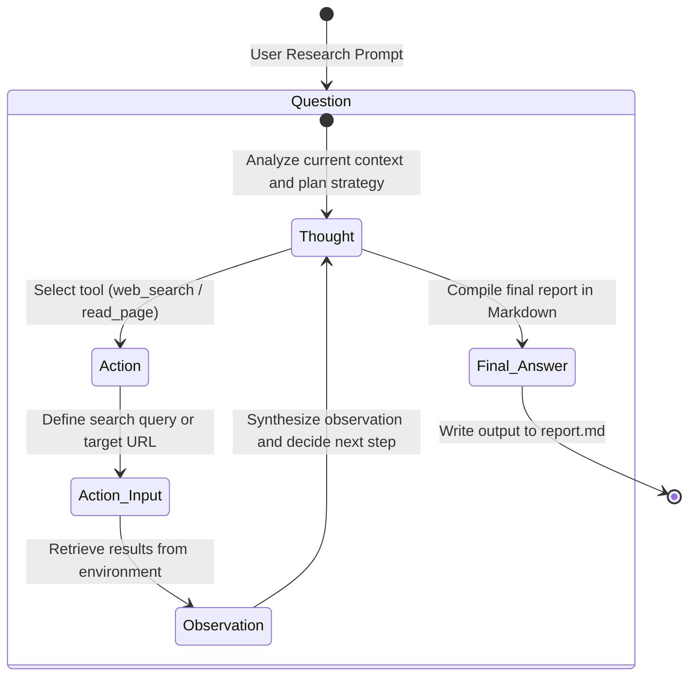

# PaperOps.ai - DeepResearch Autonomous Agent

A professional-grade, autonomous research agent powered by LangChain and Groq LLMs. This system uses the **ReAct (Reason + Act)** pattern to dynamically plan, search the web, scrape academic/informational pages, distill insights, and compile structured research reports.

---

##  System Architecture & Data Flow

PaperOps.ai is built on a modular architecture separating orchestration, the reasoning engine, and the execution toolset:

```mermaid
graph TD
    User([User]) -->|Input Topic| Main[main.py: Orchestrator]
    Main -->|Dynamic Instruction| Executor[AgentExecutor]
    
    subgraph Agent Engine (agent.py)
        Executor -->|Loop Prompt| ReAct[ReAct Agent]
        ReAct -->|Prompt Template| Prompt[AGENT_PROMPT]
        Prompt -->|LLM Request| LLM[MellowGroq LLM Wrapper]
    end
    
    LLM -->|Choose Action| ActionDecision{Action Decision}
    ActionDecision -->|web_search| SearchTool[web_search tool]
    ActionDecision -->|read_page| ReadTool[read_page tool]
    ActionDecision -->|Final Answer| Finish[Extract Report]
    
    subgraph Tool Suite (tools.py)
        SearchTool -->|Query with 2s Delay| DDG[DuckDuckGo Search Engine]
        DDG -->|Snippets| SearchTool
        ReadTool -->|HTTP GET Request| Web[Web Page HTML]
        Web -->|BeautifulSoup4 <p> extraction| Scraper[Raw Text Extractor]
        Scraper -->|Truncate to 10k chars| Context[Context Shard]
        Context -->|Direct LLM Call| SumLLM[MellowGroq LLM]
        SumLLM -->|Pre-summarized Text| ReadTool
    end
    
    SearchTool -->|Observation| Executor
    ReadTool -->|Observation| Executor
    Finish -->|Write Markdown| Output[report.md]
```

### Component Breakdown
1. **Orchestrator ([main.py](file:///d:/Ritesh/Documents/RJ/AllWork/AgenticAI/researchhelp/main.py))**: Bootstraps environment variables, prompt instructions, runs the interactive CLI loop, invokes the agent executor, and saves the final markdown payload to `report.md`.
2. **Agent Engine ([agent.py](file:///d:/Ritesh/Documents/RJ/AllWork/AgenticAI/researchhelp/agent.py))**: Builds the ReAct prompting pipeline, binds tools, handles parsing errors, enforces execution limits (`max_iterations=15`), and instantiates the rate-limit-resilient `MellowGroq` class.
3. **Tool Suite ([tools.py](file:///d:/Ritesh/Documents/RJ/AllWork/AgenticAI/researchhelp/tools.py))**: Defines standard and LLM-powered tools used during autonomous execution.

---

##  Autonomous Agent Reasoning Loop

The agent operates using the classic **ReAct** (Reasoning and Acting) loop, allowing it to solve complex multi-step research goals by alternating between thinking and invoking tools.



### The ReAct Prompt Format
The reasoning cycle uses the following system instruction structure:
* **Thought**: The LLM's internal monologue detailing its plan (e.g., *"I need to search for transformers basics first"*).
* **Action**: The action to take, which must match one of the registered tools: `[web_search, read_page]`.
* **Action Input**: The parameters required by the selected tool (e.g., a query string or URL).
* **Observation**: The output returned by the tool after execution.
* *(Repeats up to 15 times until synthesis is complete)*
* **Final Answer**: The complete, production-ready research report in Markdown.

---

##  Tool Suite Deep-Dive

Rather than overloading the main agent LLM with noisy raw data, the agent utilizes a specialized toolset configured in `tools.py`:

| Tool Name | Input | Behavior / Implementation | Output |
| :--- | :--- | :--- | :--- |
| **`web_search`** | `query: str` | Wraps `DuckDuckGoSearchRun`. It implements a polite **2-second sleep** before firing requests and catches DuckDuckGo rate limits. | A text snippet listing matching search result summaries and links. |
| **`read_page`** | `url: str` | Fetches target webpage using `requests` with a custom `User-Agent` and a **10s timeout**. Parses HTML using `BeautifulSoup` to extract all paragraph (`<p>`) texts. Truncates content to **10,000 characters** to respect context bounds. | Sends the cleaned text to the LLM to pre-summarize the key ideas, returning a dense, context-aware summary. |

> [!NOTE]
> The `read_page` tool performs a **direct intermediate LLM call** to summarize the webpage content before returning it to the main ReAct loop. This design decision significantly reduces context pollution and prevents token overflow crashes.

---

##  LLM & Rate-Limit Resilience (MellowGroq)

The agent runs on the ultra-fast Groq inference service using **Llama 3.1 8B (`llama-3.1-8b-instant`)** with `temperature=0` for deterministic, academic-quality outputs.

### Resilient Architecture: MellowGroq
Free-tier API limits on Groq can be strict. To ensure stable execution, PaperOps.ai utilizes `MellowGroq`, a custom wrapper inheriting from `ChatGroq`:
* **Rate-Limit Interception**: Automatically catches exceptions containing `429` or `rate_limit`.
* **Exponential Backoff**: Implements progressive cooldown periods (`5 + attempt * 5` seconds) and retries requests up to 5 times.
* **Request Pacing**: Introduces a base delay (`3 + attempt * 2` seconds) between requests to preemptively avoid triggering limits.

---

##  Project Structure

```bash
researchhelp/
├── .env                  # Local API credentials (ignored by git)
├── .env.example          # Template for environment variables
├── .gitignore            # Git exclusion rules
├── README.md             # Systems documentation (this file)
├── agent.py              # Agent engine configurations & MellowGroq
├── main.py               # Application entrypoint & Orchestration
├── requirements.txt      # Python dependencies
├── tools.py              # Search and scraping/summarization toolset
├── report.md             # Generated output file containing the research
└── interview.md          # Project design specifications & notes
```

---

##  Installation & Configuration

### Prerequisites
* Python 3.11 or higher
* Groq API Key (get one from the [Groq Console](https://console.groq.com/keys))

### Setup
1. **Clone the repository** and navigate to the project directory:
   ```bash
   cd researchhelp
   ```

2. **Create and activate a virtual environment**:
   ```bash
   # Windows
   python -m venv venv
   venv\Scripts\activate

   # macOS / Linux
   python3 -m venv venv
   source venv/bin/activate
   ```

3. **Install the required packages**:
   ```bash
   pip install -r requirements.txt
   ```

4. **Setup environment variables**:
   Create a `.env` file in the root directory:
   ```bash
   cp .env.example .env
   ```
   Open the `.env` file and insert your Groq API Key:
   ```env
   GROQ_API_KEY=gsk_your_actual_api_key_here
   ```

---

##  Execution & Usage

Launch the agent via your terminal:
```bash
python main.py
```

### Interactive CLI Walkthrough
1. **Prompt for Topic**: The CLI prompts you: `Enter a topic to research (e.g., 'Transformers in NLP'):`.
2. **ReAct Thought Display**: You will see the agent's live reasoning thoughts and tool invocations print in real time to the console.
3. **Execution Completion**: The agent writes the final report directly to a file named `report.md` in the current working directory.

### Example Console Log Output
```text
--- Simple Agentic AI Researcher ---

Enter a topic to research (e.g., 'Transformers in NLP'): Transformers in NLP

Initialized Agent for topic: Transformers in NLP
Agent is thinking... (Watch the output below)


> Entering new AgentExecutor chain...
Thought: I need to search the web for information on "Transformers in NLP".
Action: web_search
Action Input: Transformers in NLP

[Tool] Searching for: Transformers in NLP
Observation: [DuckDuckGo search results containing key transformer concepts and articles...]

Thought: I have search results pointing to various articles. I will read one of the main articles to get details.
Action: read_page
Action Input: https://en.wikipedia.org/wiki/Transformer_(deep_learning_architecture)

[Tool] Reading page: https://en.wikipedia.org/wiki/Transformer_(deep_learning_architecture)
Observation: Summary of https://en.wikipedia.org/wiki/Transformer_(deep_learning_architecture):
[Dense LLM summary of the Wikipedia article, focusing on architecture, history, and applications...]

Thought: I have enough key concepts, history, and applications to formulate the final report.
Action: Final Answer
Final Answer: [Full Markdown Report contents...]

> Finished chain.

[DEBUG] Raw Output length: 2059

Success! Report saved to 'report.md'
--------------------------------------------------
```

---

##  Sample Output (`report.md`)

```markdown
# Transformers in NLP

## Key Concepts
Transformers are artificial neural network architectures based on the multi-head attention mechanism. They convert text into numerical representations called tokens, which are then contextualized within a context window. Transformers have the advantage of requiring less training time than earlier recurrent neural architectures (RNNs) due to the absence of recurrent units.

## Details
The modern version of the transformer was proposed in the 2017 paper "Attention Is All You Need" by researchers at Google. Predecessors of transformers were developed as an improvement over previous architectures for machine translation. Transformers have found applications in large-scale natural language processing, computer vision, reinforcement learning, audio, multimodal learning, robotics, and playing chess...

## References
* "Attention Is All You Need" (2017) by researchers at Google
* "BERT" (2018) by researchers at Google
...
```

---

##  Design Decisions & Trade-offs

1. **Deterministic Execution (`temperature=0`)**: Enforced to ensure factual correctness, academic structure, and reliable parsing formatting.
2. **Speed & Rate-Limit Optimization (`llama-3.1-8b-instant`)**: Selected over the larger Llama 3 70B model to capitalize on significantly faster generation speeds and higher API request limits, ensuring the multi-step agent loop compiles efficiently without frequent timeouts.
3. **Decoupled Summarization (`read_page`)**: Offloading webpage parsing and summarization to an isolated sub-call protects the main agent's context workspace, preventing it from overflowing its window during multi-site reading loops.
4. **Synchronous Execution Model**: Currently, the agent operates in a single thread, checking websites one by one. This simplifies logs and debug tracking but trades off performance.

---

##  Limitations

* **Sequential Latency**: Page searches and scrapes are executed one at a time, resulting in longer overall execution times for complex topics.
* **Basic Web Scraper**: The HTML parser relies strictly on extracting paragraph (`<p>`) tags. If a webpage formats its core content using list items, tables, or generic container divs, some information may be omitted.
* **Search Instability**: DuckDuckGo searches can occasionally fail or return rate-limit prompts under high usage.
* **Static Execution Limit**: Enforces a maximum iteration cap of 15 steps. If an agent fails to synthesize its answer within 15 steps, execution halts.

---

##  Roadmap & Future Enhancements

* [ ] **Asynchronous Parallel Fetching**: Modify the toolset to query and summarize multiple webpages concurrently to dramatically reduce runtime.
* [ ] **Semantic Content Scraping**: Enhance parsing to focus selectively on core semantic elements (like `<main>`, `<article>`, and headings) while stripping header/footer navigation items.
* [ ] **LaTeX & PDF Compiler**: Implement LaTeX generation and export functions to allow compiling papers directly into academic PDFs.
* [ ] **Conversational Memory**: Add short-term and session-based conversational memory to allow interactive, iterative refinement of the generated reports.
